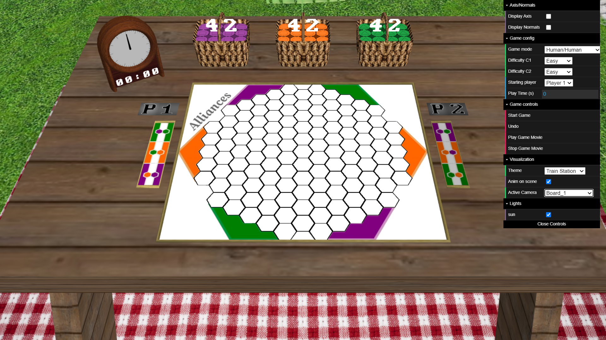
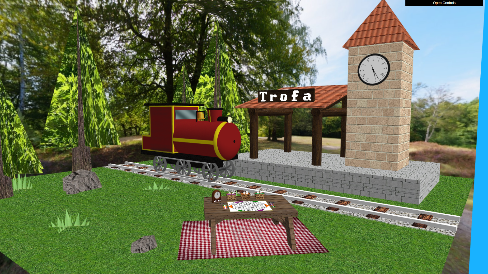
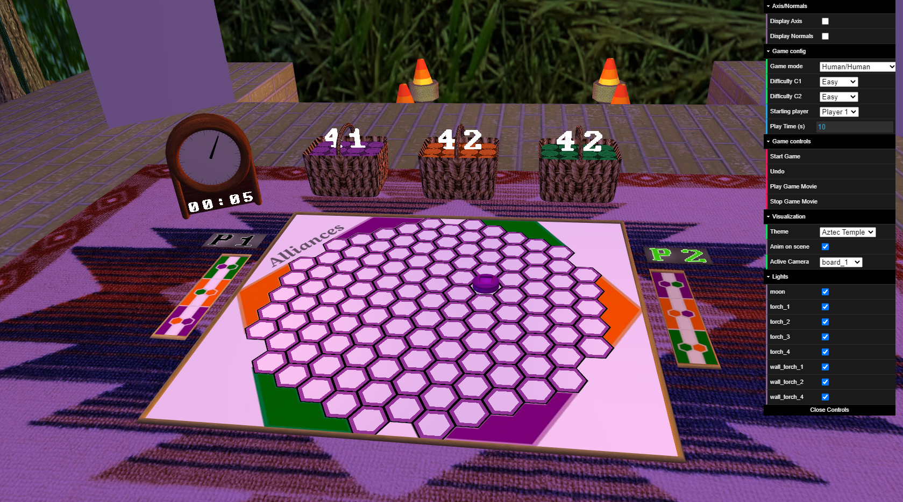
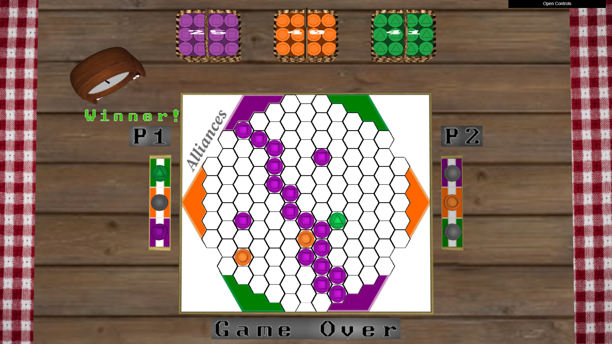

# LAIG 2020/2021

## Group T03G06
| Name             | Number    | E-Mail               |
| ---------------- | --------- | -------------------- |
| Davide Castro    | 201806512 | up201806512@edu.fe.up.pt |
| João Cardoso     | 201806531 | up201806531@edu.fe.up.pt |

----

## Description

This project consists of a visual and interactive interface for the [Alliances](https://nestorgames.com/rulebooks/ALLIANCES_EN.pdf) game. The logic for the game and the enemy choice algorithms were implemented in Prolog (https://github.com/davide-castro20/FEUP-PLOG/tree/main/Alliances_P1).

### Features:
- Two-player mode
- Single player mode (vs. Computer)
- Multiple difficulty levels
- Modifiable time per turn
- Undo move
- Animated moves
- Animated replay of all previous turns
- Different enviroments
- Animations
- Different cameras

## Screenshots

## Milestones

### [TP1 - Scene Graph](TP1)

- The models are complex and detailed;
- There are multiple cameras from different points of view of the scene, available from the interface;
- The interface is organized into different sections (axis/normals, cameras and lights);
- The user can toggle the display of the axis and the normals in the interface;
- There is a good range of different materials and textures suited for the different objects;
- Every primitive available is used on the scene with textures;
- Every type of transformation is used;
- We used the transformation, material and texture inheritance to make a better structured scene graph;
- The scene graph also has a high level of complexity;
- The scene has a good variety of objects to fill the environment;
- The project code is properly commented;
- The XML parser detects and flags a wide array of errors.
- Scene:
  - The scene consists of a steam locomotive by a forest. There are models for the locomotive, the rails it is moving on, some trees, rocks and grass, along with a skybox.
  - Scene link: "./scenes/LAIG_TP1_XML_T3_G06_v1.xml"

### [TP2 - Added features](TP2)
- The XML parser detects and flags a wide array of errors. Examples: startCell and endCell cannot be in invalid indexes in the spritesheet. Characters outside the fonts cannot be drawn
- There isn't any problem if there are multiple keyframes or sprite changes from a spritesheet between update calls
- The scene is complex and every new primitive is used (plane, patch, barrel and spritesheet animations/text)
- Detailed keyframe animations are used in the scene to create more movement, using translation, rotation and scale

### [TP3 - Alliances board game](TP3)
- Game:
	- Piece color highlighting on piece color selection.
	- Piece color reselection.
	- The game movie works on every gamemode (player vs player, - player vs bot, bot vs bot) and at any time. The game always resumes to
    the previous state after the movie ends. The game movie can be skipped to resume the game instantly.
	- The user can undo a move at any time and gamemode, including computer moves.
	- Bot difficulties are independent from one another (One bot can be on hard and the other on easy).
	- The starting player can be selected.
	- There can be a time limit per play for human players.
	- Piece animations have easing.
	- Game over, winner, player and pieces left text/indicators.
	- The gamestate and game movie's state are maintained on scene change.
    - The game can be restarted mid-game with a new configuration
- Scene:
	- Animated camera with easing that works between scene cameras AND between scenes:
		- The camera's animation time depends on the position and target of the cameras themselves (with a minimum time).
		- The camera animation works properly even if the camera is currently moving, no matter how fast or which cameras you select.
	- Both scenes are detailed, run well and are fairly light, memory and speed wise.
		The first scene has been simplified and optimized to improve the framerate
